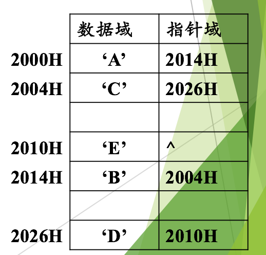

## 数组和链表

### 联系与区别

从逻辑结构上而言，数组和链表都是一种线性结构（相对于图、树这种非线性结构而言），而从存储结构上而言，数组是顺序存储的，链表则是链式存储的

关于顺序存储和链式存储的区别可以用下图来表示（左侧顺序存储，右侧链式存储）：



对于顺序存储而言其存储结构是一块连续的内存块，而链式存储则可以不是连续的内存块，并且顺序存储没有链式存储中的指针域（连续内存空间所以加 1 即可找到下一数据）

### 优劣势以及使用场景

从联系与区别之中，我们了解了数组实际上是一种顺序存储的数据结构，而链表则是链式存储的数据结构，所以实际上两者之间的优劣势体现的是顺序存储和链式存储的优劣势：

1. 数组
   - 优势
     - 可以随机存取
     - 占用空间小
   - 劣势
     - 存储空间必须静态分配
     - 插入或删除必须要移动节点
2. 链表
   - 优势
     - 存储空间动态可扩展
     - 插入和删除方便
   - 劣势
     - 指针域的存在导致占用空间大
     - 查找和读取操作较数组慢

在了解数组和链表的优劣势之后其使用场景就很明朗了

1. 从空间的角度来看
   - 如果线性表的空间变化较大，不可预知时应该选择链表
   - 如果线性表的空间变化不大且比较固定应该选择数组，能够节省空间
2. 从时间的角度来看
   - 如果线性表经常做插入和删除的操作之时，应该选择链表
   - 如果线性表经常做查询和读取而很少做插入和删除的操作之时应该采用数组

### 链表的实现与常用操作

1. 创建一个名为 Node 的类代表链表中的单个节点

   ```java
   public class Node {
       private String data;
       private Node next;

       public Node() {
           data = null;
           next = null;
       }

       public Node(String data) {
           this.data = data;
           next = null;
       }
       
       public String getData() {
           return data;
       }

       public void setData(String data) {
           this.data = data;
       }

       public Node getNext() {
           return next;
       }

       public void setNext(Node next) {
           this.next = next;
       }
   }
   ```

2. 创建一个名为 LinkList 的链表类，里面封装了一些简单的插入和删除操作

   ```java
   public class LinkList {

       private Node header;
       private Node pointer;


       public LinkList() {
           header = new Node();
           pointer = header;
       }

       public void insert(String data) {
           Node newNode = new Node(data);
           pointer.setNext(newNode);
           pointer = newNode;
       }

       public void delete(String data) {
           Node current = header;

           while (current.getNext() != null) {
               Node temp = current.getNext();
               if ((data == null && temp.getData() == null) ||
                       (data != null && data.equals(temp.getData()))) {
                   current.setNext(temp.getNext());
               }
               current = current.getNext();
           }
       }

       public Node getHeader() {
           return header;
       }
   }
   ```

### 链表的反转

链表的反转实质上就是对节点的指针域进行操作，重新建立节点联系的过程，比较简单的一种反转链表的思路是用一个新的链表去保存反转之后的链表，对原链表进行遍历，然后将每个节点采用头插法插入到新链表之中，在插入过程中将新链表的头指针往前移，这样就得到了反转链表。

